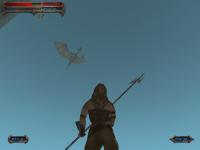
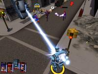

.. TUTORIAL:Pygame Python Introduction

.. include:: common.txt

.. comment
   ****************
   Pygame Intro
   ****************

****************
  Pygame 入門
****************

.. comment
   Python Pygame Introduction
   ==========================

Python Pygame 入門
==========================

.. rst-class:: docinfo

:Author: Pete Shinners
:Contact: pete@shinners.org

.. comment
   This article is an introduction to the `pygame library <http://www.pygame.org>`_
   for `Python programmers <https://www.python.org/>`_.
   The original version appeared in the `Py Zine <http://pyzine.com/?p=18>`_,
   volume 1 issue 3. This version contains minor revisions, to
   create an all-around better article. Pygame is a Python extension
   library that wraps the `SDL <http://www.libsdl.org>`_ library
   and its helpers.

この記事は `Python programmers <https://www.python.org/>`_ 向けの `pygame library <http://www.pygame.org>`_ 入門記事です。
オリジナルバージョンは、 `Py Zine <http://pyzine.com/?p=18>`_ の第１巻3号に掲載されました。
本バージョンは、より良い記事となるように細かい修正を加えています。
Pygame は `SDL <http://www.libsdl.org>`_ ライブラリとそのヘルパーをラップしたPythonの拡張ライブラリです。

.. comment
   HISTORY
   -------

   Pygame started in the summer of 2000. Being a C programmer of many
   years, I discovered both Python and SDL at about the same time. You are
   already familiar with Python, which was at version 1.5.2. You may need
   an introduction to SDL, which is the Simple DirectMedia Layer.
   Created by Sam Lantinga, SDL is a cross-platform C library for
   controlling multimedia, comparable to DirectX. It has been used for
   hundreds of commercial and open source games. I was impressed at how clean
   and straightforward both projects were and it wasn't long before I
   realized mixing Python and SDL was an interesting proposal.

   I discovered a small project already under-way with exactly the same
   idea, PySDL. Created by Mark Baker, PySDL was a straightforward
   implementation of SDL as a Python extension. The interface was cleaner
   than a generic SWIG wrapping, but I felt it forced a "C style" of code.
   The sudden death of PySDL prompted me to take on a new project of my
   own.

   I wanted to put together a project that really took advantage of
   Python. My goal was to make it easy to do the simple things, and
   straightforward to do the difficult things. Pygame was started in
   October, 2000. Six months later pygame version 1.0 was released.

歴史
-----
Pygame は 2000年の夏にスタートしました。長年、C言語のプログラマーであった私は、PythonとSDLを同時に発見しました。
当時のPythonはバージョン1.5.2でした。あなたにはすでに馴染みのあるPythonです。
あなたにはSDLの紹介が必要かもしれません。SDLは Simle DirectMedia Layerの略です。
Sam Lantingaにより作成されたSDLは、マルチメディアを制御するためのクロスプラットフォームのCライブラリです。
DirectXと比較されます。何百もの商用およびオープンソースのゲームで利用されています。
両方のプロジェクトが、なんて簡潔で直感的なんだと感銘を受けました。
そして、PythonとSDLの融合が興味深い提案であると気づくのに時間はかかりませんでした。

全く同じアイデアで、既に進行中のPySDLという小さなプロジェクトを見つけました。
Mark Bakerにより作成された PySDLはPython拡張として素直なSDL実装でした。
そのインターフェイスは一般的なSWIGラッピングよりは簡潔でしたが、"Cスタイル"のコードを強制されるように感じました。
PySDLの選択肢からなくなり、私を新しいプロジェクトに取り組むように促しました。

私は、Pythonを本当に活用したプロジェクトにしたかった。
私の目標は簡単なことを簡単に、難しいことを直感的に作成できるようにすることでした。
Pygameは2000年10月に開始されました。6ヶ月後バージョン1.0がリリースされました。

.. comment
   TASTE
   -----

   I find the best way to understand a new library is to jump straight
   into an example. In the early days of pygame, I created a bouncing ball
   animation with 7 lines of code. Let's take a look at a friendlier
   version of that same thing. This should be simple enough to follow
   along, and a complete breakdown follows.

お試し
------

新しいライブラリを理解するための最良の方法は、まっすぐ例題に飛び込むことです。
pygameの初期の頃、ボールが跳ねるアニメーションを7行で作成しました。
同じものを、よりわかりやすくしたバージョンを見ていきましょう。
これは、簡単なのでわかりやすく、そして完全な内訳です。

.. image:: intro_ball.gif
   :class: inlined-right

.. code-block:: python
   :linenos:

   import sys, pygame
   pygame.init()

   size = width, height = 320, 240
   speed = [2, 2]
   black = 0, 0, 0

   screen = pygame.display.set_mode(size)

   ball = pygame.image.load("intro_ball.gif")
   ballrect = ball.get_rect()

   while True:
       for event in pygame.event.get():
           if event.type == pygame.QUIT: sys.exit()

       ballrect = ballrect.move(speed)
       if ballrect.left < 0 or ballrect.right > width:
           speed[0] = -speed[0]
       if ballrect.top < 0 or ballrect.bottom > height:
           speed[1] = -speed[1]

       screen.fill(black)
       screen.blit(ball, ballrect)
       pygame.display.flip()

.. comment
   This is as simple as you can get for a bouncing animation.
   First we see importing and initializing pygame is nothing noteworthy.
   The ``import pygame`` imports the package with all the available
   pygame modules.
   The call to ``pygame.init()`` initializes each of these modules.

これはボールが跳ねるアニメーションとしては、限り無くシンプルなものです。
最初のpygameのインポートと初期化は特筆すべきことはありません。
``import pygame`` はpygameの利用できる全モジュールをインポートします。
``pygame.init()`` の呼び出しは、それらのモジュールを初期化します。

.. comment
   On :clr:`line 8` we create a
   graphical window with the call to ``pygame.display.set_mode()``.
   Pygame and SDL make this easy by defaulting to the best graphics modes
   for the graphics hardware. You can override the mode and SDL will
   compensate for anything the hardware cannot do. Pygame represents
   images as *Surface* objects.
   The ``display.set_mode()`` function creates a new *Surface*
   object that represents the actual displayed graphics. Any drawing you
   do to this Surface will become visible on the monitor.

:clr:`line 8` で、 ``pygame.display.set_mode()`` を呼び出し、グラフィカルなウィンドウを作成します。
PygameとSDLは、グラフィックハードウェアに最適なグラフィックモードをデフォルトで使用することで、簡単に作成します。
モードは上書きすることができ、SDLはハードウェアができないことを補うことができます。
Pygameは画像をサーフェスオブジェクトとして表現します。
``display.set_mod()`` 関数は、実際に表示されるグラフィックを表す、新しいサーフェスオブジェクトを作成します。
このサーフェスに描画すると、モニターに表示されます。

.. comment
   At :clr:`line 10` we load
   our ball image. Pygame supports a variety of image formats through the
   SDL_image library, including BMP, JPG, PNG, TGA, and GIF.
   The ``pygame.image.load()`` function
   returns us a Surface with the ball data. The Surface will keep any
   colorkey or alpha transparency from the file. After loading the ball
   image we create a variable named ballrect. Pygame comes with a
   convenient utility object type named :class:`Rect <pygame.Rect>`,
   which represents a rectangular area. Later, in the animation part of
   the code, we will see what the *Rect* objects can do.

:clr:`line 10` で、ボールの画像をロードします。
PygameはSDL_imageライブラリ経由で各種画像フォーマットをサポートします。BMP, JPG,PNG, TGA, そして GIFを含みます。
``pygame.image.load()`` 関数はボールデータを持つサーフェスを返します。
このサーフェスはファイルのカラーキーもしくは透明度の情報を保持します。
ボール画像をロード後は ``ballrect`` という名の変数に格納します。
Pygameには :class:`Rect <pygame.Rect>` という名前の便利なユーティリティオブジェクト型があります。これは矩形領域を表します。
あとから出てくる、アニメーション部分のコードで、 *Rect* オブジェクトができることを見ることになります。

.. comment
   At this point, :clr:`line 13`,
   our program is initialized and ready to run. Inside an infinite loop we
   check for user input, move the ball, and then draw the ball. If you are
   familiar with GUI programming, you have had experience with events and
   event loops. In pygame this is no different,
   we check if a *QUIT* event has happened. If so we
   simply exit the program, pygame will ensure everything is cleanly
   shutdown.

:clr:`line 13` で、このプログラムは初期化され、実行される準備が整います。
無限ループの中で、ユーザインプットをチェックし、ボールを動かし、そして、ボールを描画します。
もし、GUIプログラムに馴染があるなら、イベントやイベントループを扱ったことがあるでしょう。
Pygameにおいても、違いはありません。 *QUIT* イベントの発生をチェックし、もしあれば、プログラムを終了します。
pygameは全てがきれいにシャットダウンをされることを保証します。

.. comment
   It is time to update our position for the ball.
   :clr:`Lines 17` moves the ballrect variable by the current speed.
   :clr:`Lines 18 thru 21` reverse the speed if the ball has moved outside the screen.
   Not exactly Newtonian physics, but it is all we need.

ボールの位置を更新する時がきました。
:clr:`Lines 17` で、変数 ``ballrect`` を現在のスピードで移動させます。
:clr:`Lines 18 thru 21` で、もしボールがスクリーンの外に移動したなら、進行スピードを逆方向に変更します。
ニュートン物理学とまでいきませんが、必要なのはこれだけです。

.. comment
   On :clr:`line 23` we erase
   the screen by filling it with a black RGB color. If you have never
   worked with animations this may seem strange. You may be asking "Why do
   we need to erase anything, why don't we just move the ball on the
   screen?" That is not quite the way computer animation works. Animation
   is nothing more than a series of single images, which when displayed in
   sequence do a very good job of fooling the human eye into seeing
   motion. The screen is just a single image that the user sees. If we did
   not take the time to erase the ball from the screen, we would actually
   see a "trail" of the ball as we continuously draw the ball in its new
   positions.

:clr:`line 23` で、RBGの黒色で塗り潰してスクリーンを消します。
もし、いままでアニメーションを作成したことがなければ、これは奇妙に思えるかもしれません。
「なぜ全てを消す必要があるの? なぜ、スクリーン上のボールを、ただ動かさないの?」と尋ねるかもしれません。
それは、コンピュータのアニメーションの仕組みとは少し違います。
アニメーションは、1枚以上の画像を連続して表示することで、人間の目に動いているように錯覚させています。
スクリーンは、ユーザーから見れば、ただの一枚の画像です。
もし、画面からボールを消さなければ、ボールの新しい位置を描き続けることで、ボールの「軌跡」を見ることになります。

.. comment
   On :clr:`line 24` we draw the ball image onto the screen.
   Drawing of images is handled by the
   :meth:`Surface.blit() <pygame.Surface.blit>` method.
   A blit basically means copying pixel colors from one image to another.
   We pass the blit method a source :class:`Surface <pygame.Surface>`
   to copy from, and a position to place the source onto the destination.

:clr:`line 24` で、ボール画像をスクリーンに描画しています。
:meth:`Surface.blit() <pygame.Surface.blit>` メソッドで画像の描画を処理します。
``blit`` はピクセルをある画像から別の画像へコピーすることを意味します。
``blit`` メソッドに、コピー元となる :class:`Surface <pygame.Surface>` と、コピー元をコピー先に配置するための位置情報を渡します。

.. comment
   The last thing we need to do is actually update the visible display.
   Pygame manages the display with a double buffer. When we are finished
   drawing we call the :func:`pygame.display.flip()` method.
   This makes everything we have drawn on the screen Surface
   become visible. This buffering makes sure we only see completely drawn
   frames on the screen. Without it, the user would see the half completed
   parts of the screen as they are being created.

最後にするべきは、表示ディスプレイの更新です。
Pygameはディスプレイをダブルバッファで管理します。
描画を完了させた時に、 :func:`pygame.display.flip()` メソッドを呼び出します。
これにより、画面サーフェス上に描画した全てのものが、見えるようになります。
バッファリングにより、完全に描画されたフレームのみが画面に表示されるようになります。
これがないと、ユーザーは作成中の不完全なスクリーンを見ることになります。

.. comment
   That concludes this short introduction to pygame. Pygame also has
   modules to do things like input handling for the keyboard, mouse, and
   joystick. It can mix audio and decode streaming music.
   With the *Surfaces* you can draw simple
   shapes, rotate and scale the picture, and even manipulate the pixels of
   an image in realtime as numpy arrays.
   Pygame also has the ability to act as a
   cross platform display layer for PyOpenGL. Most of the pygame modules
   are written in C, few are actually done in Python.

これで、pygameのこの短い紹介を終ります。
Pygameには、キーボードやマウス、ジョイスティックのインプットを処理するモジュールもあります。
オーディオのミキシングやストリーミング音楽のデコードも可能です。
*Surface* を使えば、簡単な図形描画や、写真の回転・拡大、 numpy の配列を使ったリアルタイムの画像処理もできます。
Pygame は PyOpenGL 用のクロスプラットフォームの表示レイヤーとなる機能も持っています。
ほとんどのpygameモジュールはCで書かれており、Python で書かれているものは、ほとんどありません。

.. comment
   The pygame website has full reference documentation for every pygame
   function and tutorials for all ranges of users. The pygame source comes
   with many examples of things like monkey punching and UFO shooting.

pygameのWebサイトに、すべてのpygame関数の完全なリファレンス文書と、全ユーザー用のチュートリアルがあります。
pygame のソースには、モンキーパンチやUFOシューティングようにな沢山の例題があります。

.. comment
   PYTHON AND GAMING
   -----------------

   "Is Python suitable for gaming?" The answer is, "It depends on the
   game."

PYTHON と ゲーム
----------------

「Pythonはゲーミングに向いているの?」、その答えは、「ゲームによります」です。

.. comment
   Python is actually quite capable at running games. It will likely even
   surprise you how much is possible in under 30 milliseconds. Still, it
   is not hard to reach the ceiling once your game begins to get more
   complex. Any game running in realtime will be making full use of the
   computer.

Pythonは、実はゲームを動かすのに非常に適しています。
30ミリ秒以下での動作が可能であることに驚かれるでしょう。
それでも、ゲームが複雑化すると、天井に到達する場合もあります。
リアルタイムに動作するゲームの場合、コンピュータをフル活用することになります。

.. comment
   Over the past several years there has been an interesting trend in game development,
   the move towards higher level languages. Usually a game is split into
   two major parts. The game engine, which must be as fast as possible,
   and the game logic, which makes the engine actually do something. It
   wasn't long ago when the engine of a game was written in assembly, with
   portions written in C. Nowadays, C has moved to the game engine, while
   often the game itself is written in higher level scripting languages.
   Games like Quake3 and Unreal run these scripts as portable bytecode.

過去数年にわたり、ゲーム開発の興味深いトレンドがありました。それは、より高レベルの言語への移行です。
通常、ゲームは2つの主要な部分に別れます。ゲームエンジンとゲームロジックです。
ゲームエンジンは可能な限り高速である必要があります。ゲームロジックは、エンジンを実際に動かすものです。
ゲームエンジンがアセンブリで書かれ、一部はCで書かれたのは、大昔の話ではありません。
現在は、Cがゲームエンジンに使用され、ゲーム自体は高レベルのスクリプト言語で書かれます。
Quake3 や Unreal などのゲームでは、これらのスクリプトがポータブルなバイトコードとして実行れます。

.. comment
   In early 2001, developer Rebel Act Studios finished their game,
   Severance: Blade of Darkness. Using their own custom 3D engine, the
   rest of the game is written with Python. The game is a bloody action
   3rd person perspective fighter. You control medieval warriors into
   intricate decapitating combination attacks while exploring dungeons and
   castles. You can download third party add-ons for this game, and find
   they are nothing more than Python source files.

2001年の初頭に、開発社の Rebel Act Studios が 自社のゲーム Severance: Blade of Darkness を完成させました。
自社向けのカスタム3Dエンジンを使い、ゲームの残りの部分はPythonで書かれています。
このゲームは、第三者視点の血みどろアクションの戦闘ものです。
中世の戦士を操作し、ダンジョンや城を探検しながら、複雑なコンビネーションで攻撃し首を切ります。
このゲーム用のサードパーティアドオンをダウンロードできます。
これらのアドオンは、Pythonのソースファイル以外の何物でもありません。

.. comment
   More recently, Python has been used in a variety of games like Freedom
   Force, and Humungous' Backyard Sports Series.

より最近では、Freedom Force や Humungousの Backyard Sports シリーズのような様々なゲームでPythonは利用されています。

.. comment
   Pygame and SDL serve as an excellent C engine for 2D games.
   Games will still find the largest part of their runtime is spent
   inside SDL handling the graphics.
   SDL can take advantage of graphics hardware acceleration.
   Enabling this can change a game from running around 40 frames per
   second to over 200 frames per second. When you see your Python game
   running at 200 frames per second, you realize that Python and games can
   work together.

Pygame と SDL は 優れた Cで作成された2Dゲームエンジンとして機能します。
ゲームの実行時間の大部分は、グラフィックを処理するSDL内部で費されます。
SDLはグラフィックのハードウェアアクセレーションを利用できます。
これを有効にすると、1秒間に40フレーム程度で動作していたゲームが、
1秒間に200フレーム以上で動作することになります。
Pythonゲームが1秒間に200フレームで動作するとわかれば、
Pythonとゲームが一緒に動作できると実感します

.. comment
   It is impressive how well both Python and SDL work on multiple
   platforms. For example, in May of 2001 I released my own full pygame
   project, SolarWolf, an arcade style action game. One thing that has
   surprised me is that one year later there has been no need for any
   patches, bug fixes, or updates. The game was developed entirely on
   windows, but runs on Linux, Mac OSX, and many Unixes without any extra
   work on my end.

PythonとSDLの両方がマルチプラットフォームで動作することは印象的です。
例えば、2001年5月、私自身の完全なpygameプロジェクトをリリースしました。
それは、アーケードスタイルのアクションゲームである SolarWolf です。
1年たって、私が驚いたことは、バグフィックスや更新のためのパッチが必要ないということです。
このゲームは完全にWindows上で開発しましたが、
Linux や Mac OSX や 多くのUnixで、何の追加作業もなく動作しています。

.. comment
   Still, there are very clear limitations. The best way to manage
   hardware accelerated graphics is not always the way to get fastest
   results from software rendering. Hardware support is not available on
   all platforms. When a game gets more complex, it often must commit to
   one or the other. SDL has some other design limitations, things like
   full screen scrolling graphics can quickly bring your game down to
   unplayable speeds. While SDL is not suitable for all types of games,
   remember companies like Loki have used SDL to run a wide variety of
   retail quality titles.

まだ、非常に明らかな限界はあります。
ハードウェアアクセレーショングラフィックの最適な管理方法が、
必ずしも、ソフトウェアレンダリングの最速の結果を得るとは限りません。
ハードウェアのサポートは全プラットフォームで利用できるわけではありません。
ゲームをより複雑にすれば、多くの場合、どちらかにコミットする必要があります。
SDLは、他の設計上の制限があります。
それは、フルスクリーンのスクロールするグラフィックが、
ゲームをプレイできない速度にまで低下させるというものです。
SDLは全種類のゲームに向いているわけではないけれど、
Lokiのような会社がSDLを使って、さまざまな種類の商用品質のタイトルを提供していることを覚えておいてください。

.. comment
   Pygame is fairly low-level when it comes to writing games. You'll
   quickly find yourself needing to wrap common functions into your own
   game environment. The great thing about this is there is nothing inside
   pygame to get in your way. Your program is in full control of
   everything. The side effect of that is you will find yourself borrowing
   a lot of code to get a more advanced framework put together. You'll
   need a better understanding of what you are doing.

Pygameはゲームを書くことについてはローレベルです。
あなたはすぐに、一般的な関数を自分のゲーム環境用にラップする必要があることに気が付くでしょう。
この場合に素晴らしいところは、あなたの邪魔をするものが Pygame にはないことです。
あなたのプログラムはすべてをコントロールできます。

その副作用として、より高度なフレームワークを構築するために、多くのコードを取り入れる必要があることがわります。
あなたは、自分のしていることを、より深く理解する必要があります。

.. comment
   CLOSING
   -------

最後に
-------

.. comment
   Developing games is very rewarding, there is something exciting about
   being able to see and interact with the code you've written. Pygame
   currently has almost 30 other projects using it. Several of them are
   ready to play now. You may be surprised to visit the pygame website,
   and see what other users have been able to do with Python.

ゲームの開発は、大変やりがいがのあるものです。
書いたコードで、見たり、対話できるのは、とてもエキサイティングです。
Pygameは現在、だいたい30件の他プロジェクトが利用しています。
そのうちのいくつかは、今すぐ遊べるようになっています。
pygameのWebサイトを訪ずれて、他のユーザーがPythonで実現していることを見て驚くかもしれません。

.. comment
   One thing that has caught my attention is the amount of people coming
   to Python for the first time to try game development. I can see why
   games are a draw for new programmers, but it can be difficult since
   creating games requires a firmer understanding of the language. I've
   tried to support this group of users by writing many examples and
   pygame tutorials for people new to these concepts.

私が注目しているのは、ゲーム開発をするために、初めてPythonに触れる人の多さです。
ゲームが新しいプログラマにとって魅力的なのはわかりますが、
ゲームを作るには言語をしっかり理解する必要があるので、難しいかもしれません。
このような人達をサポートするために、多くの例題や
pygameのコンセプトが初めての人のためのチュートリアルを書きました。

.. comment
   In the end, my advice is to keep it simple. I cannot stress this
   enough. If you are planning to create your first game, there is a
   lot to learn. Even a simpler game will challenge your designs, and
   complex games don't necessarily mean fun games. When you understand
   Python, you can use pygame to create a simple game in only one or two
   weeks. From there you'll need a surprising amount of time to add
   the polish to make that into a full presentable game.

結局のところ、私からのアドバイスは「シンプルであること」です。これは、いくら強調してもしきれません。
もし、最初のゲームの開発を計画しているなら、学ぶべきことが沢山あります。
シンプルなゲームでさえ、デザインに挑戦できるでしょうし、複雑なゲームが必ずしも楽しいゲームとは限りません。
Pythonを理解すれば、1、2週間でpygameを使って簡単なゲームを作成できます。
そこから、完全に体裁を整えたゲームにするために磨きをかけるには、驚くほどの時間が必要です。

.. comment
   Pygame Modules Overview
   ^^^^^^^^^^^^^^^^^^^^^^^

Pygame モジュールの概要
^^^^^^^^^^^^^^^^^^^^^^^

.. csv-table::
   :class: more-to-explore
   :widths: 20, 50

   :mod:`cdrom <pygame.cdrom>`, "playback"
   :mod:`cursors <pygame.cursors>`, "load cursor images, includes standard cursors"
   :mod:`display <pygame.display>`, "control the display window or screen"
   :mod:`draw <pygame.draw>`, "draw simple shapes onto a Surface"
   :mod:`event <pygame.event>`, "manage events and the event queue"
   :mod:`font <pygame.font>`, "create and render TrueType fonts"
   :mod:`image <pygame.image>`, "save and load images"
   :mod:`joystick <pygame.joystick>`, "manage joystick devices"
   :mod:`key <pygame.key>`, "manage the keyboard"
   :mod:`mouse <pygame.mouse>`, "manage the mouse"
   :mod:`sndarray <pygame.sndarray>`, "manipulate sounds with numpy"
   :mod:`surfarray <pygame.surfarray>`, "manipulate images with numpy"
   :mod:`time <pygame.time>`, "control timing"
   :mod:`transform <pygame.transform>`, "scale, rotate, and flip images"
